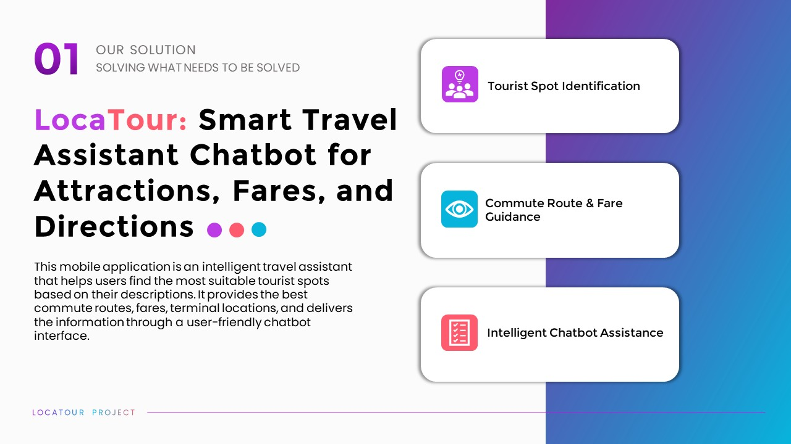
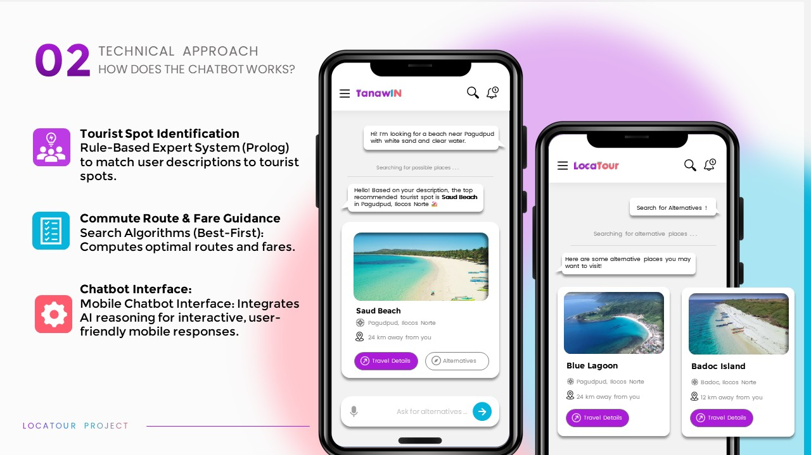
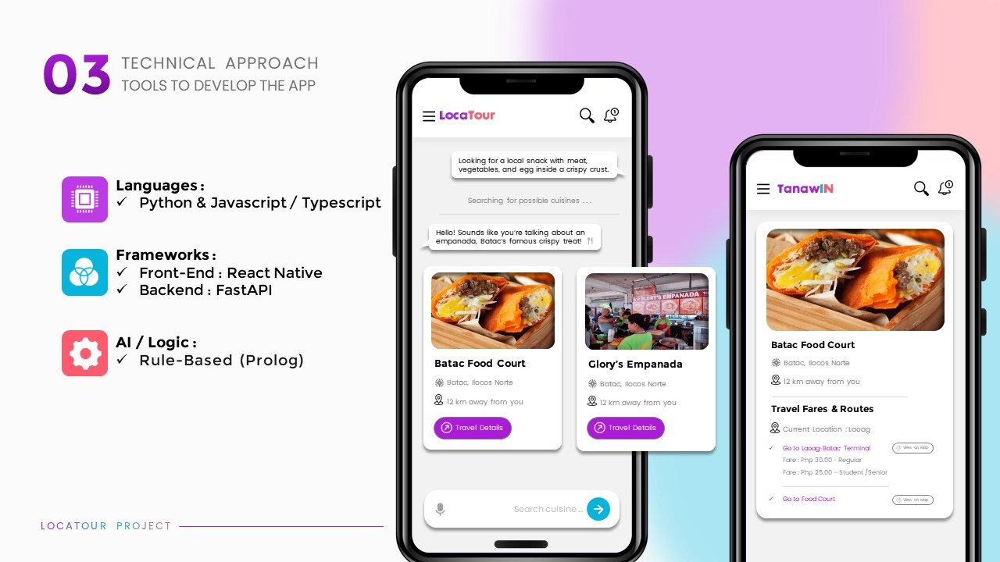
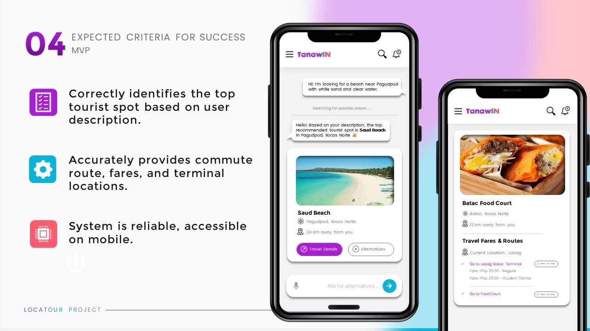

# Tourism Chatbot Mobile

This mobile application is an intelligent travel assistant that helps users find the most suitable tourist spots based on their descriptions. It provides the best commute routes, fares, terminal locations, and delivers the information through a user-friendly chatbot interface.

---

## OVERVIEW

### The App / The Team


### Features Overview



### Technical Approach



### Tools



### MVP



---

## Features

- Find tourist spots based on user input
- Suggest optimal commute routes and fares
- Show terminal locations
- Interactive chatbot interface

---

## Installation

1. Clone the repository:
   ```bash
   git clone https://github.com/yourusername/tourism-chatbot-mobile.git
   ```
